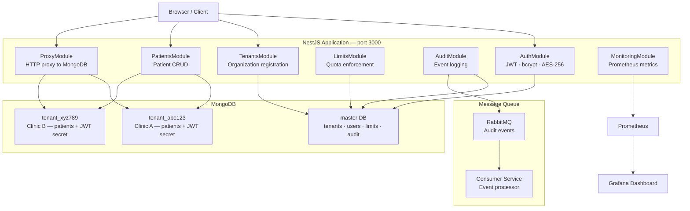
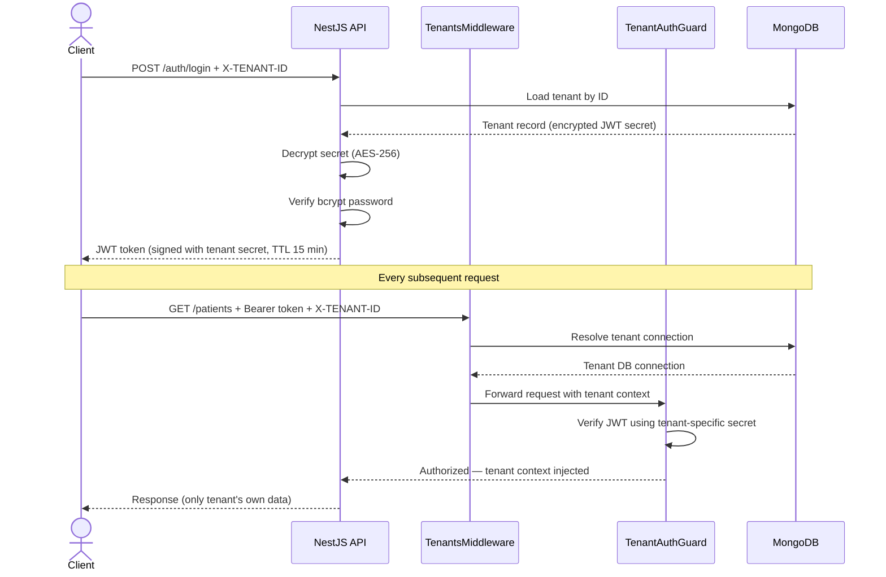
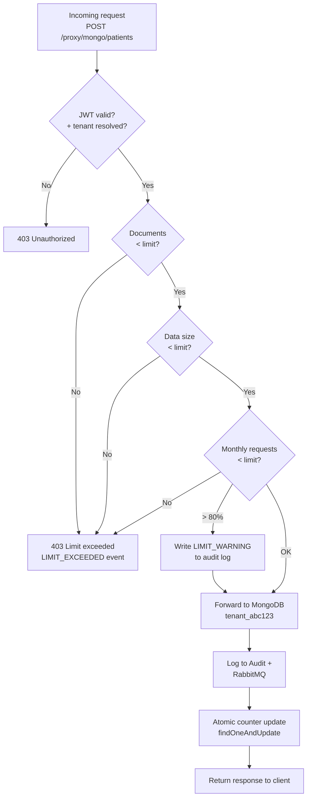
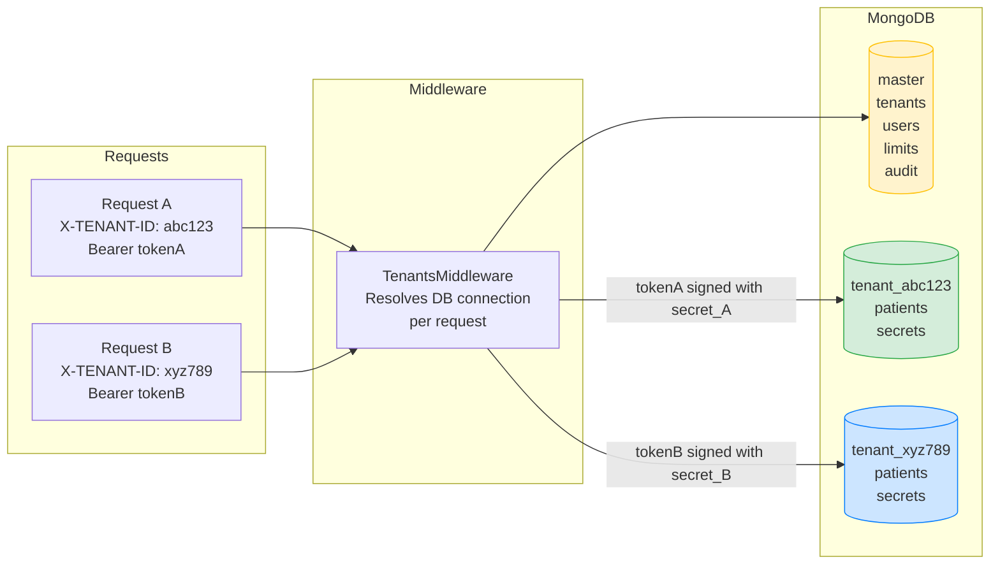

<div align="center">

# Health Information System

**Multi-tenant hospital management platform with per-tenant data isolation, a custom data-limiting proxy, and real-time monitoring.**


Bachelor's thesis · Software Development · Unicorn University, Prague · 2025–2026

[🇷🇺 Русский](#-русский) · [🇬🇧 English](#-english) · [🇨🇿 Čeština](#-čeština)

</div>

---

## Architecture



---

## Request lifecycle — authentication and tenant isolation



---

## Proxy and quota enforcement



---

## Multi-tenancy data isolation



---

# 🇷🇺 Русский

Многотенантная система управления медицинской информацией. Каждая клиника получает изолированную MongoDB-базу, уникальный JWT-секрет и лимиты использования ресурсов. Между клиентами и базой стоит собственный прокси-сервер, который перехватывает запросы, проверяет токены и следит за квотами.

## Что умеет система

**Изоляция тенантов.** Данные пациентов больницы A физически хранятся в отдельной базе `tenant_<id>`. Один тенант не может даже случайно достучаться до чужих данных — это гарантируется на уровне подключений к БД, не только на уровне фильтрации запросов.

**Data-limiting proxy.** Самописный HTTP-прокси перехватывает запросы к MongoDB и проверяет три вида лимитов: количество документов, размер данных в килобайтах и количество запросов в месяц. Лимиты обновляются атомарно через `findOneAndUpdate` — гонки состояний исключены.

**JWT с секретом на тенанта.** Каждая организация при регистрации получает уникальный JWT-секрет, зашифрованный AES-256 (через Cryptr). Токен больницы A физически не пройдёт валидацию в контексте больницы B.

**Аудит всего.** Каждый HTTP-запрос логируется через NestJS Interceptor — в MongoDB (всегда) и в RabbitMQ (если доступен). Фиксируются превышения лимитов, CRUD-операции, ошибки аутентификации.

**Мониторинг.** Prometheus-метрики на `/metrics`: счётчик запросов, гистограмма времени ответа, счётчик нарушений лимитов, gauge использования ресурсов. Grafana поднимается одной командой.

## Стек

| Слой | Технологии |
|---|---|
| Backend | NestJS 11, Express, TypeScript |
| База данных | MongoDB 7, Mongoose 8 |
| Очередь | RabbitMQ 3.12 |
| Мониторинг | Prometheus, Grafana |
| Frontend | React 19, Vite 8, TanStack Query, Framer Motion, Tailwind CSS 4 |
| Инфраструктура | Docker, Docker Compose |
| Деплой | Render.com + MongoDB Atlas |

## Быстрый старт

### Требования

- Node.js 20+
- Docker + Docker Compose
- MongoDB (локально или Atlas)

### Локальная разработка

```bash
# 1. Клонировать репозиторий
git clone https://github.com/Rimas07/Health-information-system.git
cd Health-information-system

# 2. Установить зависимости
cd His && npm install --legacy-peer-deps

# 3. Создать .env файл
cp .env.example .env

# 4. Запустить MongoDB и RabbitMQ
docker-compose up mongodb rabbitmq -d

# 5. Запустить бэкенд
npm run dev

# 6. В отдельном терминале — фронтенд
cd ../frontend && npm install && npm run dev
```

| Сервис | URL |
|---|---|
| Приложение | http://localhost:3000 |
| Swagger API | http://localhost:3000/api |
| Прокси | http://localhost:3001/mongo/* |

### Полный запуск через Docker

```bash
docker-compose up --build
```

```bash
# Мониторинг
docker-compose -f docker-compose.monitoring.yml up -d
# Grafana: http://localhost:3002  (admin / admin)
```

## Переменные окружения

| Переменная | Описание |
|---|---|
| `PORT` | Порт сервера (по умолчанию 3000) |
| `DB_CONNECTION_STRING` | MongoDB connection string |
| `RABBITMQ_URL` | URL брокера RabbitMQ |
| `ENCRYPTION_KEY` | Мастер-ключ шифрования JWT-секретов (мин. 32 символа) |

## API

Полная документация — Swagger `/api`

```
POST /auth/login                  — авторизация → JWT + tenantId
POST /tenants/create-company      — регистрация организации

GET  /patients                    — список пациентов
POST /patients                    — создать пациента
PUT  /patients/:id                — обновить
DELETE /patients/:id              — удалить

GET  /limits/:tenantId            — текущие лимиты
PUT  /limits/:tenantId            — изменить лимиты
GET  /limits/usage/:tenantId      — статистика использования

GET  /audit                       — журнал событий
GET  /audit/stats                 — сводная статистика

GET  /metrics                     — Prometheus-метрики
```

Все защищённые маршруты требуют:
```
Authorization: Bearer <token>
X-TENANT-ID: <tenantId>
```

### Пример: создать организацию

```bash
curl -X POST http://localhost:3000/tenants/create-company \
  -H "Content-Type: application/json" \
  -d '{
    "companyName": "City Hospital",
    "user": {
      "name": "Admin",
      "email": "admin@hospital.ru",
      "password": "secure123"
    }
  }'
```

## Лимиты и квоты

| Параметр | По умолчанию |
|---|---|
| Максимум документов | 1 000 |
| Максимум размера данных | 50 МБ (51 200 KB) |
| Запросов в месяц | 1 000 |

При достижении 80% — предупреждение `LIMIT_WARNING`. При превышении — 403 и событие `LIMIT_EXCEEDED`. Проверка атомарна.

## Безопасность

- Пароли — bcrypt (cost factor 10)
- JWT-секрет уникален на тенанта, хранится зашифрованным AES-256
- Время жизни токена — 15 минут
- Rate limiting: 50 req/min через `@nestjs/throttler`, 10 req/min на прокси
- Кросс-тенантное использование токена невозможно по архитектуре

## Структура проекта

```
his/
├── src/
│   ├── auth/           — аутентификация, JWT, шифрование
│   ├── tenants/        — управление организациями
│   ├── patients/       — CRUD пациентов
│   ├── users/          — пользователи
│   ├── limits/         — квоты и их проверка
│   ├── audit/          — журналирование событий
│   ├── proxy/          — HTTP-прокси к MongoDB
│   ├── monitoring/     — Prometheus-метрики
│   ├── guards/         — TenantAuthenticationGuard
│   ├── middlewares/    — TenantsMiddleware
│   ├── providers/      — провайдеры tenant-подключений
│   ├── services/       — TenantConnectionService
│   ├── config/         — конфигурация
│   └── utils/          — encrypt/decrypt
├── frontend/
│   └── src/
│       ├── pages/      — LoginPage, DashboardPage, PatientsPage, LimitsPage
│       ├── components/ — UI-компоненты, AppLayout
│       ├── api/        — axios-клиент с interceptors
│       └── types/      — TypeScript-типы
├── consumer/           — микросервис обработки событий
├── producer/           — микросервис публикации событий
├── docker-compose.yml
├── docker-compose.monitoring.yml
├── Dockerfile
└── prometheus.yml
```

---

# 🇬🇧 English

A multi-tenant hospital information system. Each clinic gets its own isolated MongoDB database, a unique JWT secret, and resource usage limits. A custom proxy server sits between clients and the database, validating tokens and enforcing quotas on every request.

## What it does

**Tenant isolation.** Patient data for hospital A is stored in a dedicated database `tenant_<id>` — not mixed with other tenants. Isolation is enforced at the connection level, not just query filtering.

**Data-limiting proxy.** A custom HTTP proxy intercepts requests to MongoDB and enforces three quota types: document count, data size in kilobytes, and monthly request count. Limits are updated atomically via `findOneAndUpdate` — no race conditions.

**Per-tenant JWT secrets.** Each organization receives a unique JWT secret on registration, encrypted with AES-256 (via Cryptr). A token issued for hospital A will fail validation in the context of hospital B by design.

**Full audit trail.** Every HTTP request is logged via a NestJS Interceptor — to MongoDB (always) and RabbitMQ (when available). Limit violations, patient CRUD, and auth errors are all captured.

**Monitoring.** Prometheus metrics at `/metrics`: request counter, response time histogram, limit violation counter, resource usage gauge. Grafana dashboard with a single command.

## Tech stack

| Layer | Technologies |
|---|---|
| Backend | NestJS 11, Express, TypeScript |
| Database | MongoDB 7, Mongoose 8 |
| Queue | RabbitMQ 3.12 |
| Monitoring | Prometheus, Grafana |
| Frontend | React 19, Vite 8, TanStack Query, Framer Motion, Tailwind CSS 4 |
| Infrastructure | Docker, Docker Compose |
| Deployment | Render.com + MongoDB Atlas |

## Quick start

### Requirements

- Node.js 20+
- Docker + Docker Compose
- MongoDB (local or Atlas)

### Local development

```bash
git clone https://github.com/Rimas07/Health-information-system.git
cd Health-information-system

cd His && npm install --legacy-peer-deps
cp .env.example .env

docker-compose up mongodb rabbitmq -d
npm run dev

# In a separate terminal
cd ../frontend && npm install && npm run dev
```

| Service | URL |
|---|---|
| App | http://localhost:3000 |
| Swagger API | http://localhost:3000/api |
| Proxy | http://localhost:3001/mongo/* |

### Docker (full stack)

```bash
docker-compose up --build

# Monitoring
docker-compose -f docker-compose.monitoring.yml up -d
# Grafana: http://localhost:3002  (admin / admin)
```

## Environment variables

| Variable | Description |
|---|---|
| `PORT` | Server port (default 3000) |
| `DB_CONNECTION_STRING` | MongoDB connection string |
| `RABBITMQ_URL` | RabbitMQ broker URL |
| `ENCRYPTION_KEY` | Master key for encrypting tenant JWT secrets (min 32 chars) |

## API

Full docs at Swagger `/api`

```
POST /auth/login                  — login → JWT + tenantId
POST /tenants/create-company      — register organization

GET  /patients                    — list patients
POST /patients                    — create patient
PUT  /patients/:id                — update
DELETE /patients/:id              — delete

GET  /limits/:tenantId            — current limits
PUT  /limits/:tenantId            — update limits
GET  /limits/usage/:tenantId      — usage statistics

GET  /audit                       — event log
GET  /audit/stats                 — system summary

GET  /metrics                     — Prometheus metrics
```

All protected routes require:
```
Authorization: Bearer <token>
X-TENANT-ID: <tenantId>
```

### Example: register organization

```bash
curl -X POST http://localhost:3000/tenants/create-company \
  -H "Content-Type: application/json" \
  -d '{
    "companyName": "City Hospital",
    "user": {
      "name": "Admin",
      "email": "admin@hospital.com",
      "password": "secure123"
    }
  }'
```

## Limits and quotas

| Parameter | Default |
|---|---|
| Max documents | 1,000 |
| Max data size | 50 MB (51,200 KB) |
| Monthly requests | 1,000 |

At 80% of any limit, a `LIMIT_WARNING` is written to the audit log. On exceeding, the request is rejected with 403 and a `LIMIT_EXCEEDED` event. All checks are atomic.

## Security

- Passwords hashed with bcrypt (cost factor 10)
- JWT secret is unique per tenant, stored AES-256 encrypted
- Token lifetime — 15 minutes
- Rate limiting: 50 req/min via `@nestjs/throttler`, 10 req/min on the proxy
- Cross-tenant token use is impossible by architecture

## Project structure

```
his/
├── src/
│   ├── auth/           — authentication, JWT, encryption
│   ├── tenants/        — organization management
│   ├── patients/       — patient CRUD
│   ├── users/          — users
│   ├── limits/         — quota enforcement
│   ├── audit/          — event logging
│   ├── proxy/          — HTTP proxy to MongoDB
│   ├── monitoring/     — Prometheus metrics
│   ├── guards/         — TenantAuthenticationGuard
│   ├── middlewares/    — TenantsMiddleware
│   ├── providers/      — tenant connection providers
│   ├── services/       — TenantConnectionService
│   ├── config/         — app configuration
│   └── utils/          — encrypt/decrypt
├── frontend/
│   └── src/
│       ├── pages/      — LoginPage, DashboardPage, PatientsPage, LimitsPage
│       ├── components/ — UI components, AppLayout
│       ├── api/        — axios client with interceptors
│       └── types/      — TypeScript types
├── consumer/           — event consumer microservice
├── producer/           — event producer microservice
├── docker-compose.yml
├── docker-compose.monitoring.yml
├── Dockerfile
└── prometheus.yml
```

## Deploying to Render.com

1. Create a Web Service, point to the repository
2. Build: `npm install --legacy-peer-deps && npm run build`
3. Start: `node dist/src/main.js`
4. Add environment variables
5. MongoDB connects via Atlas connection string

When `RENDER=true`, the proxy does not start on a separate port.

---

# 🇨🇿 Čeština

Vícenájemný systém pro správu nemocničních informací. Každá klinika získá vlastní izolovanou MongoDB databázi, jedinečný JWT-secret a limity využití zdrojů. Mezi klienty a databází stojí vlastní proxy server, který ověřuje tokeny a hlídá kvóty.

## Co systém umí

**Izolace tenantů.** Data pacientů nemocnice A jsou fyzicky uložena v samostatné databázi `tenant_<id>`. Izolace je vynucena na úrovni databázových připojení, ne pouze filtrací dotazů.

**Data-limiting proxy.** Vlastní HTTP proxy zachycuje požadavky do MongoDB a kontroluje tři druhy limitů: počet dokumentů, velikost dat v kilobytech a počet požadavků za měsíc. Limity se aktualizují atomicky přes `findOneAndUpdate`.

**JWT s tajemstvím pro každého tenanta.** Každá organizace obdrží jedinečný JWT-secret zašifrovaný AES-256. Token vydaný pro nemocnici A neprojde validací v kontextu nemocnice B.

**Auditní záznamy.** Každý HTTP požadavek je zalogován přes NestJS Interceptor — do MongoDB (vždy) a do RabbitMQ (pokud je dostupný).

**Monitoring.** Prometheus metriky na `/metrics`. Grafana dashboard se spustí jedním příkazem.

## Technologický stack

| Vrstva | Technologie |
|---|---|
| Backend | NestJS 11, Express, TypeScript |
| Databáze | MongoDB 7, Mongoose 8 |
| Fronta | RabbitMQ 3.12 |
| Monitoring | Prometheus, Grafana |
| Frontend | React 19, Vite 8, TanStack Query, Framer Motion, Tailwind CSS 4 |
| Infrastruktura | Docker, Docker Compose |
| Nasazení | Render.com + MongoDB Atlas |

## Rychlý start

```bash
git clone https://github.com/Rimas07/Health-information-system.git
cd Health-information-system

cd His && npm install --legacy-peer-deps
cp .env.example .env

docker-compose up mongodb rabbitmq -d
npm run dev

# V druhém terminálu
cd ../frontend && npm install && npm run dev
```

| Služba | URL |
|---|---|
| Aplikace | http://localhost:3000 |
| Swagger API | http://localhost:3000/api |
| Proxy | http://localhost:3001/mongo/* |

```bash
# Plné spuštění přes Docker
docker-compose up --build

# Monitoring
docker-compose -f docker-compose.monitoring.yml up -d
# Grafana: http://localhost:3002  (admin / admin)
```

## Limity a kvóty

| Parametr | Výchozí hodnota |
|---|---|
| Maximální počet dokumentů | 1 000 |
| Maximální velikost dat | 50 MB (51 200 KB) |
| Požadavků za měsíc | 1 000 |

Při dosažení 80 % se zapíše `LIMIT_WARNING`. Při překročení je požadavek odmítnut s 403 a událostí `LIMIT_EXCEEDED`.

## Bezpečnost

- Hesla hashována bcryptem (cost factor 10)
- JWT-secret je jedinečný pro každého tenanta, uložen zašifrovaný AES-256
- Platnost tokenu — 15 minut
- Rate limiting: 50 req/min přes `@nestjs/throttler`, 10 req/min na proxy
- Použití tokenu napříč tenanty je konstrukčně znemožněno

## Nasazení na Render.com

1. Vytvořit Web Service, nasměrovat na repozitář
2. Build: `npm install --legacy-peer-deps && npm run build`
3. Start: `node dist/src/main.js`
4. Přidat proměnné prostředí
5. MongoDB se připojuje přes Atlas connection string

Při `RENDER=true` se proxy nespouští na samostatném portu.

---

## License / Лицензия / Licence

UNLICENSED — academic project / учебный проект / akademický projekt
